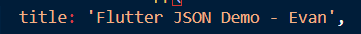
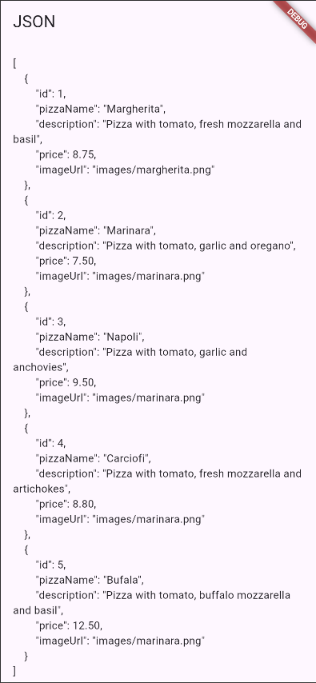
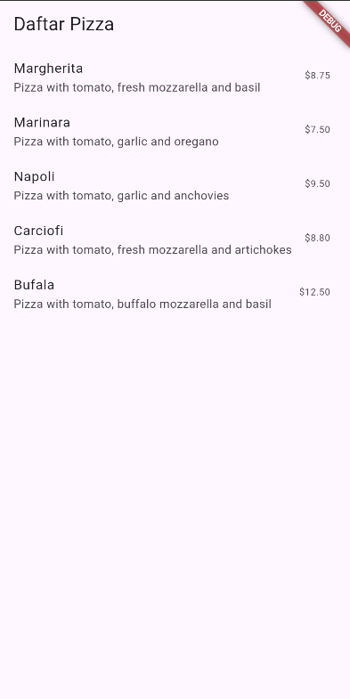
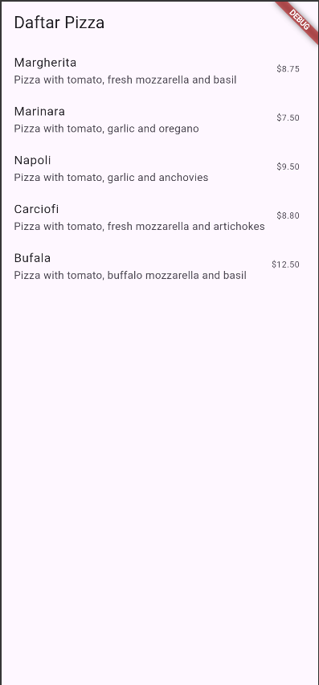
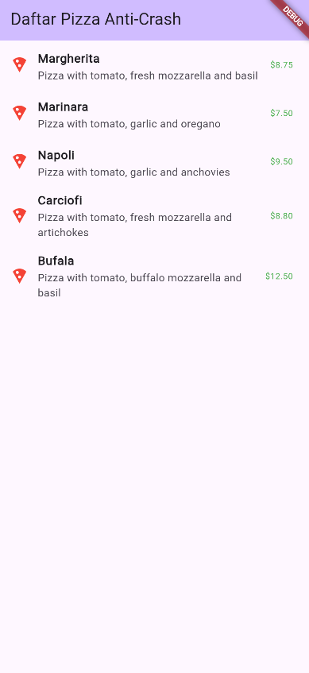

# store_data_evan

## Praktikum 1
**Soal 1**

**Soal 2**

**Soal 3**

## Praktikum 2
**Soal 4**

## Praktikum 3
**Soal 5**

kode ini memiliki jaring pengaman yang mencegah aplikasi crash atau menampilkan Runtime Error (layar merah) ketika menghadapi data yang tidak terduga atau rusak dari sumber luar (seperti API atau file JSON).

